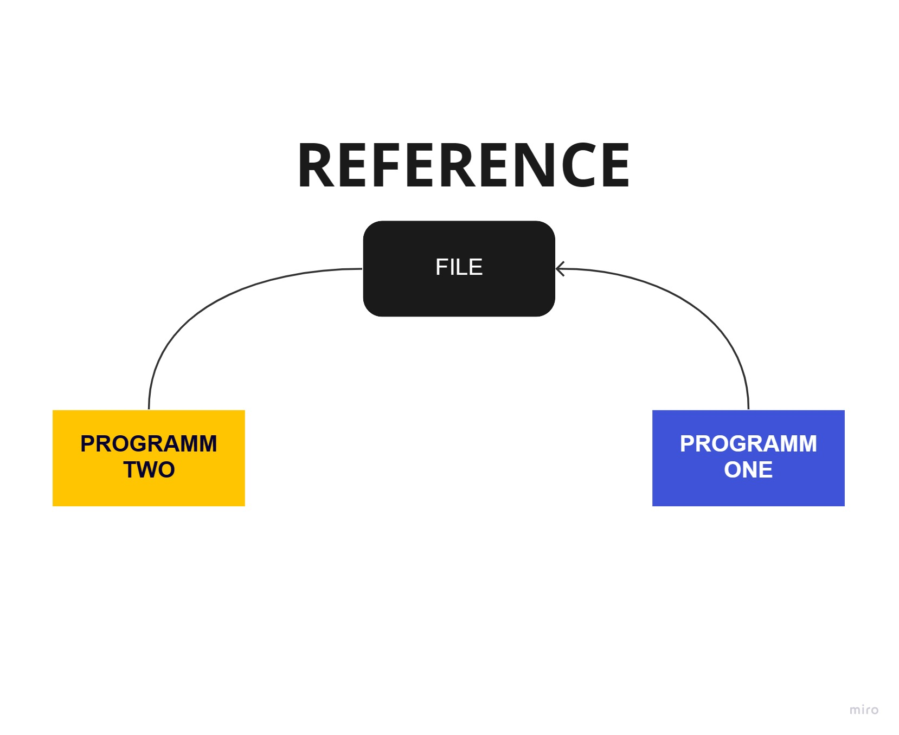
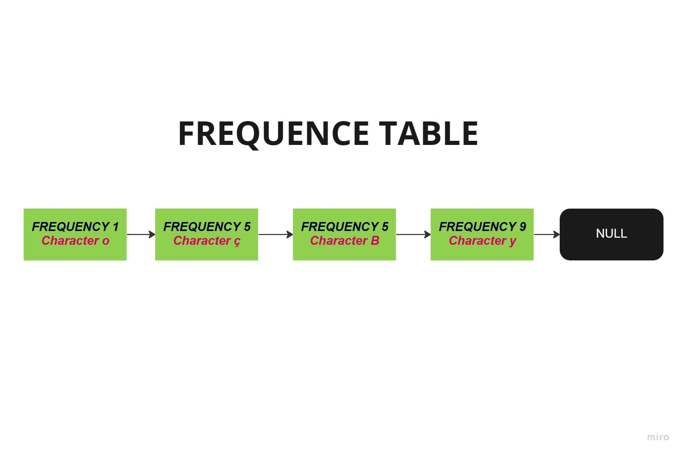

<h1 align="center"> 42RAR </h1>

<p align="center"> A 42 project written in C language</p>

<p align="center">
  
  
</p>

---

- [Introduction](#introduction)
- [Explanation](#explanation)
- [Shared Memory](#shared-memory)
- [Huffman Algorithm](#huffman-algorithm)
- [RoadMap](#roadmap)
- [Usage](#%EF%B8%8F-usage)
- [Reference](#reference)
- [Subject](#subjetc)

## Introduction

<p> This project had the purpose of create two programms (encoder and decoder), establishing communication via shared memory. in addition, the huffman algorithm for compressing multiple texts was required.</p>

---

### Explanation
We aimed to use shared memory in conjunction with the huffman algorithm. To merge this, we did the compression of multiple texts in the encoder program and, through the shared memory, we sent this compressed file. In the decoder, the file goes through a process to be decompressed and sent back to the encoder. In the end, the encoder creates files with the uncompressed text, a file with all the texts compressed, and a file with all the texts uncompressed, and finally, it displays execution information.
There are two issues to be discussed, let's start with shared memory.

#### Shared memory
There are many ways to communicate between processes and programs. In this project, we were introduced to shared memory operations. With it, we can establish communication between two different programs, whether or not they run at the same time. For this, this type of sharing uses the location of the files as a reference, making both programs find the same block of memory associated with the chosen file. Thus, we managed to establish a connection that is useful and simple to use.


*_Consult the [code](src/01_encoder.c) for more details_

##### ftok
To use shared memory, we use the ftok function, which returns a numerical key associated with the name of the file we chose:
```c
key = ftok("Makefile", proj_id);
```
##### shmget
Uses the generated key to create a shared memory block associated with the key, returning a shared memory block ID:
```c
id = shmget(key, size_block, 0644 | IPC_CREAT);
```
##### shmat
It takes the ID and maps the block to this address space returns a block pointer to use.
```c
void *block = shmat(id_block, NULL, 0);
```
##### shmdt
Issues a warning that the memory has already been used by the current program. This function does not release the block, it only issues the warning:

##### shmclt
Permanently erase memory

---

### Huffman Algorithm

#### Frequence table
To start solving the project, I needed to create a table that had the number of times a character from the ascii table appeared. We call this a "frequency table".
To do this, just loop through the ascii table size to allow for all possible characters.

#### Sorted list
Now, the algorithm needs the frequency table to be sorted, that is, the characters that are least, at the beginning. By making a linked list, this was possible:


*_Consult the [code](src/05_sorted_list.c.c) for more details_

#### Tree
With the frequency table ready, we can go ahead and assemble the tree.
The rules are simple: We take the 2 characters with the lowest frequency, and we join them as children in a parent node. This node will receive the summed frequency of the two children, and will be placed in the frequency table according to their summed frequency. By repeating this process, the moment will come when the tree will be mounted:


<br />*_Consult the [code](src/06_huffman_tree.c) for more details_

#### Dictionary
With the tree, we managed to assemble the dictionary with the codes that we will use to identify the characters.
Each tree node has a left (0) and a right (1) child. The dictionary is formed from the path we take in the tree until we reach the character. Each one is unique.

#### Coded text
With this code for each character, it is enough for us to go through the entire text of original characters, and form a new file with the identification corresponding to the dictionary.

#### Compress code
In addition to the encoded file, we have to compress it. Thus, as the dictionary only has 0 and 1 to define the characters, we can put 8 of these zeros and ones within 1 byte (8 bits). So we do the compression.

#### Decompress code
After the file is compressed, to decompress it, we need to do the opposite way. We take each byte and access the 8 positions it has, from zero to eighth. If we find the number one, we write it to the file, if it is 0, we do the same, until the uncompressed text is formed.

#### Decoded text
Finally, we have the file in code format again (coding). Thus, we only need to access from the first index to the last of the coded file, making the path of the tree from the root, to find the characters corresponding to the code. When we find a character, we go back to the root, until we reach the end of the code.

### RoadMap
A roadmap I made, based on my code, of the path from the encoder program to the decoder program and how they share information to fully use huffman's algorithm:


<br />*_Consult the [code](src/01_encoder.c) for more details_

## 🛠️ Usage
<p> For use this aplication, follow these steps:</p>

- Clone this repository:
```
https://github.com/42sp/42labs-selection-process-v4-willianportilho
```

## 🤖 Makefile Commands
- `make` to create *.o objects and compile encoder and decoder programms;
- `make clean` to erase *.o objects;
- `make fclean` to erase *.o objects and encoder and decoder programms;
- `make re` to erase *.o objects and encoder and decoder programms, and recriate *.o and encoder and decoder programms;

### How To Use The Programm

_First_: if you ever want to zip one or more text files:
A zipped file (.zip) is generated
``` c
./encoder -zip your_text_to_zip your_another_text_to_zip ...
```
_Second_: to unzip your texts:
without flags or arguments
``` c
./decode
```
_Third_: to get the files separated (.42 extension), and one file with all of them togheter (.all extension):<br />
``` c
./encoder -unzip
```
*you can use this command if a memory error occur
``` c
ipcrm -a
```
_ENJOY!_

---
### Reference
[Algoritmo de Huffman](https://www.youtube.com/playlist?list=PLqJK4Oyr5WShtxF1Ch3Vq4b1Dzzb-WxbP)<br/>
[Alg. Huffman - Artigo](https://www.ime.usp.br/~pf/estruturas-de-dados/aulas/huffman.html)<br/>
[How Algorithms Like Huffman Works](https://www.ime.usp.br/~pf/analise_de_algoritmos/aulas/guloso.html)<br/>
[IPC](https://www.geeksforgeeks.org/ipc-shared-memory/)<br/>
[Programmim IPC](https://dextutor.com/program-for-ipc-using-shared-memory/)<br/>
[Shared Memory - Jacob](https://www.youtube.com/watch?v=WgVSq-sgHOc)<br/>
[Shared Memory - Tutorial](https://www.tutorialspoint.com/inter_process_communication/inter_process_communication_shared_memory.htm)<br/>
[Recursion](https://www.youtube.com/playlist?list=PL8iN9FQ7_jt689UWkf4wnWSHT_puJohh5)<br/>
[Recursion - Binary Tree](https://www.youtube.com/watch?v=z7XwVVYQRAA&list=PL8iN9FQ7_jt7LwqmdiyhVVu2J4jQQ9uRW&index=8)<br/>


---

# Subjetc

## Labs 4º Edição

## Desafio

O desafio consiste no desenvolvimento de uma aplicação de análise e compressão de dados. Essa aplicação utilizará o algoritmo de compressão Huffman e poderá receber múltiplos dados onde, uma vez que comprimido deve ser descomprimido e coletar informações pertinentes para a análise do processo e dado.

Para isso, você criará dois programas: `encoder` e `decoder`. O encoder receberá o dado a ser comprimido e exibirá suas informações vindas do decoder. Já, o decoder descomprimirá o dado e irá enviá-lo ao encoder com suas informações, onde será exibido. Os programas devem se comunicar utilizando *shared memory operations*.

A linguagem C será utilizada para o desenvolvimento e não há bibliotecas externas permitidas.

## É necessário

- Que existam dois programas `encoder` e `decoder` que se comuniquem via memória compartilhada.
- Que o `encoder` possa receber, no mínimo, múltiplos textos como dado e comprimi-lo. Caso mais de um texto seja enviado, devem ser comprimidos juntos, resultando em apenas um único dado.
- Que o algoritmo de Huffman seja implementando em sua totalidade e que o processo de compressão e descompressão ocorram utilizando-o.
-  Que o `decoder` possa descomprimir e enviar as seguintes informações ao `encoder`: dado descomprimido, quantidade de bits ou bytes totais, quantidade de bits ou bytes comprimidos e o tempo da operação de descompressão.
- O `encoder` exibir as informações recebidas pelo `decoder`.

### O que será avaliado

- Código bem escrito e limpo.
- A documentação do seu código.
- Ferramentas que foram utilizadas e por quê.
- Sua criatividade e capacidade de lidar com problemas diferentes.
- Alinhamento do seu projeto com a proposta.

### O mínimo necessário

- README.md com a documentação contendo informações do projeto.

### Bônus

Os itens a seguir não são obrigatórios, mas são funcionalidades que darão mais valor ao seu desafio.

- Compressão de múltiplos arquivos binários.
- Criptografia do dado comprimido, utilizando senha fornecida pelo usuário.
- Verificação de integridade do arquivo comprimido.
- Opção para escolher mais outro algoritmo de compressão a ser utilizado.
- Tempo de descompressão (`decoder`) abaixo da média dos candidatos.
- Cuidados especiais com otimização e padrões de código.
- Uso de ferramentas externas para planejamento nas etapas de desenvolvimento.

<sub><sup>[Importante](https://xkcd.com/1381/)</sup></sub>
